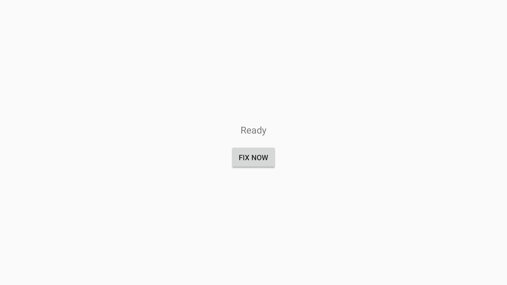
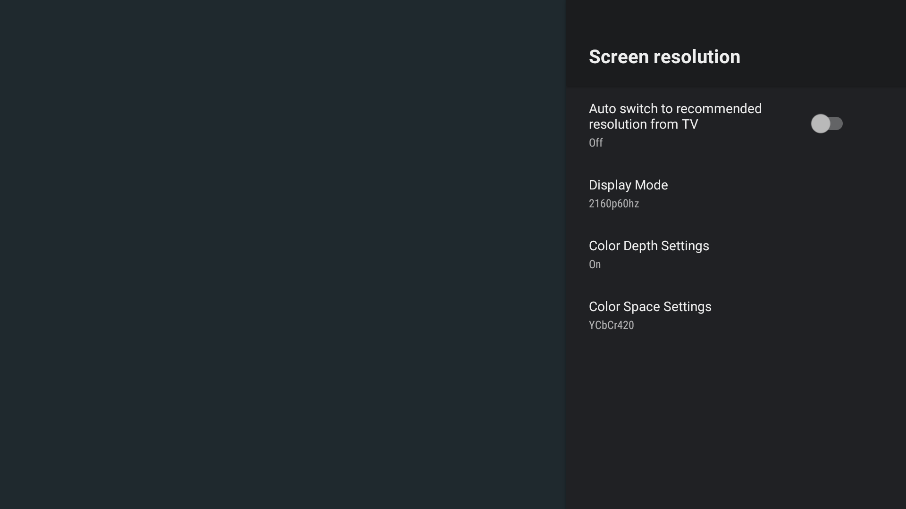

# Deep Color Toggle

Fix HDMI color-depth (deep color) handshake failures on Android TV boxes **automatically**, no root required.

[](https://github.com/fedebyes/mibox-deep-color-toggle/actions/workflows/build.yml)
[](LICENSE)



## The problem

TV → LED sync box → TV chain (e.g. Mi Box S → HDMI LED sync box → LG TV) all power
on together. The HDMI handshake fails, the color matrix comes up wrong, and the only
manual fix is toggling **Color Depth Settings** off → on once. Doing that on every
boot/wake gets old fast.

## What it does

A tiny framework-only Android app (no AndroidX, no Internet permission) that:

- listens for **boot** and **screen-on** events;
- opens the system display-settings screen and emits the verified tap sequence that
  toggles Color Depth off → on;
- **guards** itself: the toggle runs at most once per boot/wake window (dual
  elapsed + wall-clock guard), and the sequence aborts if any step is rejected.

Requires **no root** and **no PC at boot**. The only permission is the
accessibility service, which you enable once after install.

## Screenshots

| App | Display settings (what the app automates) |
|---|---|
|  |  |

## Compatibility

| | |
|---|---|
| Min Android | 8.0 (API 28) |
| Target Android | 15 (API 36) |
| Tested on | Xiaomi Mi Box S (Android 9, DroidLogic firmware) |
| Display settings UI | `com.droidlogic.tv.settings.display.DisplayActivity` (1080p coordinates) |

> ⚠️ The tap sequence is **coordinate-based** and verified against the Mi Box S's
> DroidLogic 1080p settings UI. On other boxes/firmware the coordinates may need
> adjusting — see `Config.kt` and re-verify with `uiautomator dump`.

## Build

Requires JDK 17 and the Android SDK (path via `local.properties`).

```bash
gradle :app:testDebugUnitTest   # 15 unit tests (pure Kotlin, no device)
gradle :app:assembleDebug       # APK at app/build/outputs/apk/debug/app-debug.apk
gradle :app:bundleRelease       # AAB for Play Store (signed if keystore configured)
```

Release signing reads an optional `keystore.properties` from
`~/.local/secrets/asus/deepcolor-upload-keystore.properties` — when absent,
release builds are unsigned.

## Install on a TV box (one-time, PC needed)

```bash
bash scripts/install.sh            # adb over WiFi, default 192.168.1.137:5555
BOX_IP=192.168.1.168:5555 bash scripts/install.sh   # override box address
```

Installs the APK and enables the accessibility service (appends to the existing
service list — never overwrites other enabled services).

## Verify

```bash
bash scripts/verify.sh
```

Shows the active display mode and enabled accessibility services. After a reboot,
the box should negotiate the correct 4K mode and colors should be right.

## Privacy

No data is collected, stored remotely, or shared. The app has no Internet
permission. It keeps two timestamps locally (last toggle run) to avoid re-toggling
every screen-on. See [PRIVACY_POLICY.md](PRIVACY_POLICY.md).

## License

MIT — see [LICENSE](LICENSE).
